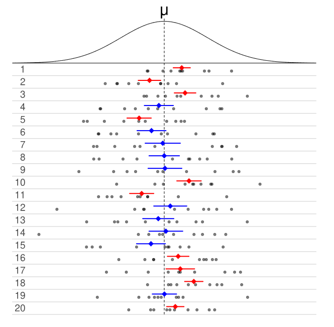

# Confidence Intervals {#CI}

## Introduction

In Section \@ref(clt), we learned about sampling distributions of statistics. For example, we could use the sample mean systolic blood pressure of 750 randomly selected American adults to estimate the mean systolic blood pressure of all American adults. We also established that statistics such as the sample mean have randomness in them. If we were to obtain another random sample of 750 American adults, the sample mean blood pressure from this other sample is likely to be different from the original random sample. So is there uncertainty in our sample mean due to random sampling. 

You might notice in Section \@ref(clt) that we know the sampling distribution of some common statistics, or we can derive the sampling distribution using simulations. In these instances, the value of the corresponding parameters were known. This is unrealistic in real life; the purpose of what we do is to use data from our sample to infer the characteristics in the population!

This section will be more realistic: the values of the population parameters are unknown. In this section, we will introduce confidence intervals. Confidence intervals build on the ideas from Section \@ref(clt): that statistics are random and we can quantify their uncertainty. The purpose of a confidence interval is to provide a range of plausible values for an unknown population parameter, based on a sample. A confidence interval not only provides the estimated value of the parameter, but also a measure of uncertainty associated with the estimation.

We will first cover confidence intervals for the mean and confidence intervals for the proportion, two of the most basic confidence intervals. These intervals are based on the fact that the distribution of their corresponding statistics, the sample mean and sample proportion, are known as long as certain conditions are met. You will notice that the general ideas in finding confidence intervals are pretty similar; confidence intervals for other statistics that have known distributions will be constructed similarly. 

We will learn about the bootstrap, which is used when the distribution of a statistic is unknown, in Section \@ref(boot). 

## Confidence Interval for the Mean {#CImean}

### Randomness of Estimators

Suppose we are trying to estimate the mean systolic blood pressure of all American adults, by using the sample mean of 750 randomly selected American adults. The sample mean is an estimator for the population mean. We want to be able to report the value of the estimator, as well as our uncertainty about the estimator. A way to measure the uncertainty of an estimator is through the variance or standard error of the estimator. Larger values indicate a higher degree of uncertainty, as an estimator with larger variance means that the value of the estimator is likely to be different among random samples. 

We will start with the confidence interval for a mean, since its sampling distribution is known (see Section \@ref(distsampmean)). We will use this setting to explain concepts associated with confidence intervals. We will then generalizing these concepts to other estimators with known distributions. 

### Randomness of Confidence Intervals

The **confidence interval** is a probability applied to the estimator $\bar{X}_n$. Instead of focusing on the estimated value of the sample mean and its variance, we construct a confidence interval for the mean that takes the form:

\begin{equation} 
I = \left(\bar{X}_n - \epsilon, \bar{X}_n + \epsilon \right).
(\#eq:8-CIbasic)
\end{equation}

Some terminology associated with intervals of the form in equation \@ref(eq:8-CIbasic):

- $\epsilon$ is often called the **margin of error**. (Yes that margin of error that you often see reported in election polls). This value is a function of the standard error of the estimator, so it gives a measure of uncertainty of the estimated value. 

  - Remember that the uncertainty being measured is the uncertainty due to random sampling, not due to other sources of uncertainty such as not getting a representative sample, people lying, etc. As mentioned in earlier modules, other methods are used to handle such issues and belong to the field of survey sampling, which is very interesting and an active area of research. We will not get into these issues in this class.

- The value of $\bar{X}_n - \epsilon$ is often called the **lower bound** of the confidence interval. 

- The value of $\bar{X}_n + \epsilon$ is often called the **upper bound** of the confidence interval. 

- The value of $\bar{X}_n$ is often called the **point estimate** of the population mean.

Equation \@ref(eq:8-CIbasic) is sometimes expressed as 

\begin{equation} 
\text{point estimate } \pm \text{ margin of error}.
(\#eq:8-CIbasic2)
\end{equation}

Indeed, a lot of confidence intervals take on the form expressed in equation \@ref(eq:8-CIbasic2), as long as the sampling distribution of the estimator is symmetric. Given the interval for the mean expressed in equation \@ref(eq:8-CIbasic), we ask what is the probability that the interval $I$ includes the true value of the parameter $\mu$, i.e. we want to evaluate

\begin{equation} 
P(\mu \in  I) = P(\bar{X}_n - \epsilon \leq \mu \leq \bar{X}_n + \epsilon).
(\#eq:8-CIprob)
\end{equation}

It is important to bear in mind that since the estimator, the sample mean $\bar{X}_n$ is a random variable, there will also be randomness in the interval $I$. The numerical values of the lower and upper bounds will change with a different random sample, since the value of $\bar{X}_n$ will change.

The idea of the interval $I$ being random is represented in Figure \@ref(fig:8-CI) below:

```{r 8-CI, fig.cap = "Randomness of Confidence Interval. Picture from [wikipedia](https://en.wikipedia.org/wiki/Confidence_interval)", echo = FALSE}

```

- The density curve in the top of Figure \@ref(fig:8-CI) represents the PDF of a random variable, that represents the distribution of some variable in the population that we wish to study. 
- Each row of dots represents the values of 10 randomly sampled data points from the PDF.
- The colored lines in each row represent the lower and upper bounds of a 50% confidence interval calculated from the sampled data points in the row.
- The colored dot in the center of the confidence interval represents $\bar{x}$ for the sampled data points in the row.
- The intervals in blue represent confidence intervals that contain the value of $\mu$, while the intervals in red represent confidence intervals that do not contain the value of $\mu$.

In Figure \@ref(fig:8-CI), we note that 50% of the confidence intervals capture the value of $\mu$, so the probability per equation \@ref(eq:8-CIprob) is 0.5. This matches with theory since each confidence interval in Figure \@ref(fig:8-CI) was computed at 50\% confidence. 

If we were to create 95% confidence intervals for each row in Figure \@ref(fig:8-CI), the upper and lower bounds of the intervals will be adjusted so that we will expect 19 of these 20 intervals to contain the value of $\mu$. 

This illustration gives us an interpretation of the probability associated with a confidence interval per equation \@ref(eq:8-CIprob): When we construct a 95\% confidence interval, there is a 95\% chance the random interval $I$ will contain the true value of the parameter. In other words, if we have 100 random samples and we construct 95\% confidence intervals based on each sample, we expect 95 of these intervals to contain the value of the parameter. 

The idea of the probability that the random interval $I$ captures the true parameter gives rise to the **confidence level**. The confidence level of a confidence interval is denoted by $1-\alpha$, i.e. if we construct an interval at 95\% confidence, $\alpha=0.05$. Equation \@ref(eq:8-CIprob) can be written as

\begin{equation} 
P(\bar{X}_n - \epsilon \leq \mu \leq \bar{X}_n + \epsilon) = 1 - \alpha.
(\#eq:8-CIalpha)
\end{equation}

We will then say $I$ is a $(1-\alpha) \times 100\%$ confidence interval, or $I$ is a confidence interval with confidence level of $(1-\alpha) \times 100\%$.

Now that we have established that confidence intervals are random and the definition of the confidence level, we are ready to go into the details of constructing the confidence interval for the mean.
