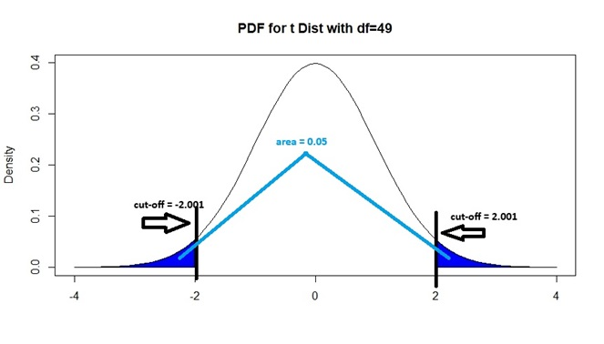
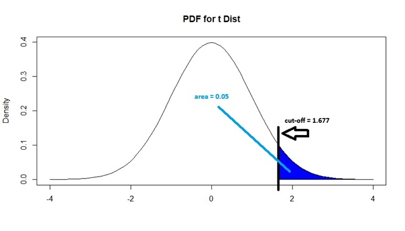
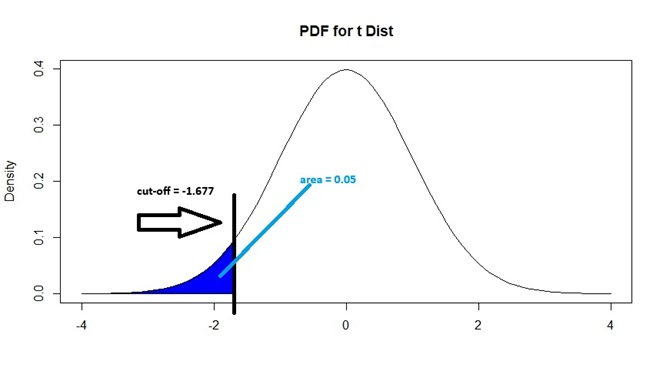

# Hypothesis Testing for Means  {#hyp}

## Introduction

Consider this scenario: you are conducting clinical trials to assess whether a new vaccine is more effective than existing vaccines. Suppose the efficacy of existing vaccines on a certain disease is 80%, and you conduct clinical trials on 30 patients, and the new vaccine is effective on 25 patients. How strong is this result in trying to prove that the new vaccine is more effective than existing vaccines? Questions like these lead to hypothesis testing.

In previous modules, we have established the fact that estimators are likely to deviate from the value from their corresponding parameter, due to random sampling. Confidence intervals allow us to provide a measure of uncertainty over our estimator as well as a range of plausible values for the parameter, using concepts regarding the sampling distribution of estimators. These concepts can also be used to assess whether our observed value for the estimator is different enough from a potential value of the parameter that random sampling alone is unlikely to be the only reason for the difference. Once this assessment is done, we then want to make a conclusion and decision about the unknown parameter. This is the big picture idea behind hypothesis testing. **Hypothesis testing** is a method for making a systematic decision with statistical guarantees.

Hypothesis testing typically has the following steps:

1. State a hypothesis, based on the research question.
2. Assume the hypothesis is true, and then compute a metric that measures how much our observed data deviates from the assumed hypothesis.
3. Compare the metric with some sort of threshold to assess if our observed data deviates "far enough" from the assumed hypothesis, and then make a decision. 

For ease of exposition, we will introduce these ideas in the framework of the hypothesis test for the mean. We then show how the framework applies in two other situations: hypothesis test for paired means and hypothesis test for two independent means.

A hypothesis is a statement which we assess whether is true or not using our observed data. In the framework of hypothesis testing, we state two competing hypotheses:

- The first hypothesis is the **null hypothesis**. This is normally the "status quo".

- The other hypothesis is the **alternative hypothesis**. This can be viewed as a statement that is "opposite" of the null hypothesis. 

Many authors present these hypotheses and hypothesis testing using a court trial as an analogy. Defendants are assumed to be "innocent until proven guilty". The "null hypothesis" or status quo in this setting is that the defendant is innocent, and the "alternative hypothesis" is that the defendant is guilty. The prosecutor needs to then present evidence that contradicts the null hypothesis in order to prove guilt. The jurors, who come into the trial assuming the defendant is innocent, then assess how strong is the evidence presented: if its strength is beyond a certain threshold (i.e. beyond "reasonable doubt") then there is evidence to reject the null hypothesis and decide the defendant is guilty. However, if the evidence is not strong enough, there is not enough evidence to reject the null hypothesis and the jury renders a not guilty verdict. 

## Hypothesis Test for the Mean {#testmean}

When testing for the mean, the parameter is the population mean. This happens when the variable we are measuring is quantitative. Consider this example: 

The term "Freshman 15" is an expression which says that college students gain 15 pounds (on average), in their first year in college. Researchers claim that with better education regarding healthier lifestyle habits, this gain is less than 15 pounds, on average. 

We will conduct a hypothesis test for the mean. Some authors call this a 1-sample $t$ test for the mean, since it involves only 1 sample (college students) and is based on the $t$ distribution. 

Next, we cover the first step in hypothesis testing: how to write the null and alternative hypothesis statements.

### Null and Alternative Hypotheses

Null and alternative hypotheses are statements regarding the value of a parameter. 

For the Freshman 15 example, the null hypothesis is that the average weight gain for first year college students is 15 pounds. This is denoted as $H_0: \mu = 15$, where $H_0$ denotes the null hypothesis. The alternative hypothesis is that the average weight gain for first year college students is less than 15 pounds. This is denoted as $H_a: \mu < 15$, where $H_a$ denotes the alternative hypothesis. 

#### Features of Null and Alternative Hypotheses

- Null and alternative hypotheses are always about a population parameter, not a sample estimator. The reason is that we want to make a claim about the population, based on data in our sample. Notice in the Freshman 15 example, that our null and alternative hypotheses are about the population mean $\mu$ and not the sample mean $\bar{x}$.

- The **null hypothesis** is a statement that says the parameter is equal to some specific value. Let $\mu_0$ denote this specific value. So we write $H_0: \mu = \mu_0$. In the Freshman 15 example, $\mu_0 = 15$.

- The **alternative hypothesis** is a statement against the null hypothesis. For the hypothesis test for the mean, there are a few possible alternative hypotheses. Which one we use is **driven by the research question**. The alternative hypothesis could say the parameter is:

  - Different from some specific value, i.e. $H_a: \mu \neq \mu_0$. This is called a **two-sided alternative** since the parameter could be greater or less than some specific value. 
  
  - Greater than some specific value, i.e. $H_a: \mu > \mu_0$. This is called a **one-sided alternative** since the parameter is greater than some specific value.
  
  - Less than some specific value, i.e. $H_a: \mu < \mu_0$. This is also called a one-sided alternative since the parameter is less than some specific value. 
  
So for the hypothesis test for the mean, there are 3 options for the alternative hypothesis.
  
In the Freshman 15 example, researchers claim that with better education, the average weight gain is less than 15 pounds, so that is why we write $H_a: \mu < 15$. 

#### Some Comments about the Null Hypothesis with a One-sided Alternative 

A number of textbooks take the view that the null and alternative hypotheses are complements, so if we write $H_a: \mu < \mu_0$, then we must write $H_0: \mu \geq \mu_0$. This way of writing a null hypothesis is different from that I wrote earlier: that the null hypothesis says the parameter is equal to $\mu_0$. There are a couple of reasons why I say the null hypothesis is a statement involving an equality, rather than an inequality:

1. The calculations performed to assess the evidence our data provides are done assuming the null hypothesis is true. You will realize in the later subsections that one can only perform these calculations if the null hypothesis says the parameter is equal to some specific value.

2. I have seen many people get confused with the null and alternative hypotheses if they insist the null and alternative must be opposite with a one-sided alternative. Indeed, if you look at Practice Exercise 9.3 and 9.4 in our book, the author has gotten these confused in the proposed solutions. 

### Test Statistic

After writing the null and alternative hypotheses, the next step is to compute a value that measures how far our sample data are from their expected value if the null hypothesis is true. This value is called the **test statistic**. How a test statistic is calculated is based on the sampling distribution of the estimator being used. 

We remind ourselves of the sampling distribution of the sample mean, $\bar{X}_n$, from Section \@ref(distsampmean). There are a couple of conditions to consider:

1. $X_1, \cdots, X_n$ are i.i.d. from a normal distribution with finite mean $\mu$ and finite variance $\sigma^2$. Then $\bar{X}_n \sim N(\mu, \frac{\sigma^2}{n})$.

2. $X_1, \cdots, X_n$ are i.i.d. from any distribution with finite mean $\mu$ and finite variance $\sigma^2$, and if $n$ is large enough, then $\bar{X}_n$ is approximately $N(\mu, \frac{\sigma^2}{n})$. 

If either of these conditions are met, then the distribution of $\bar{X}_n$ after standardization is either a standard normal or approaches a standard normal distribution, so $\frac{\bar{X}_n - \mu}{\frac{\sigma}{\sqrt{n}}} = \frac{\bar{X}_n - \mu}{\sqrt{Var(\bar{X})}} = \frac{\bar{X}_n - \mu}{SE(\bar{X}_n)}$ is either standard normal or approximately standard normal when $n$ is large enough. 

We then learned in Section \@ref(CImeant) that since the value of the population variance $\sigma^2$ is almost always unknown in real life, we use the sample variance $s^2$ instead. So we work with $\frac{\bar{X}_n - \mu}{\frac{s}{\sqrt{n}}}$ instead, which follows a $t$ distribution with $n-1$ degrees of freedom. 

Based on this distribution, the test statistic for a hypothesis test for the mean is

\begin{equation} 
\hat{t} =  \frac{\bar{x}_n - \mu_0}{\frac{s}{\sqrt{n}}} = \frac{\bar{x}_n - \mu_0}{SE(\bar{x}_n)},
(\#eq:9-teststatMean)
\end{equation}

where $SE(\bar{x}_n)$ is $\frac{s}{\sqrt{n}}$. This can be called a **$t$ statistic** to reflect that our test statistic is based on the $t$ distribution. The $t$ statistic follows a $t_{n-1}$ distribution (the subscript refers to the degrees of freedom) if either of the 2 conditions are met for the sampling distribution of $\bar{X}_n$ to be valid, and if we assume the null hypothesis is true, that the true mean of the data is $\mu_0$.

Note: A number of hypothesis tests involving other estimators and parameters are also based on the $t_{df}$ distribution, and have their own $t$ statistics. However, $t$ statistics will take on the general form 

\begin{equation} 
\hat{t} =  \frac{\text{estimated value }- \text{ value in } H_0}{\text{standard error of estimator}}.
(\#eq:9-tstatGen)
\end{equation}

Notice how equation \@ref(eq:9-tstatGen) is a generalization of equation \@ref(eq:9-teststatMean).

Note: A variation of this test is the 1-sample $z$-test for the mean. This assumes the population standard deviation is known, but that is unlikely in reality. The sample standard deviation in equation \@ref(eq:9-teststatMean) is replaced by the population standard deviation and the test statistic becomes a $Z$ statistic as it is compared with a standard normal distribution. 

We go back to the Freshman 15 example. Suppose researchers collect a random sample of 50 first-year college students. Their average weight gain is 14 pounds, with standard deviation of 3 pounds. Derive the value of the $t$ statistic.

Using equation \@ref(eq:9-teststatMean), the $t$ statistic is:

$$
\begin{split}
\hat{t} &= \frac{14-15}{\frac{3}{\sqrt{50}}} \\
        &= -2.357023.
\end{split}
$$
This $t$ statistic is valid since our sample size is 50, which is usually large enough for the approximation to the $t$ distribution to be valid.

Remember that the test statistic is a measure of how far our sample data are from their expected value if the null hypothesis is true. Larger values of the test statistic (in magnitude) imply that our data deviate further from the null hypothesis, i.e. our data provide more evidence against the null hypothesis. 

The $t$ statistic also has this nice definition: it is the distance between our sample estimator and the value of the parameter if the null hypothesis is true, in terms of number of standard errors. So for our Freshman 15 example, the sample mean is 2.357 standard errors smaller than the hypothesized value of 15.

#### Factors Affecting $t$ Statistic for Mean {#factors}

We have established that larger values of the test statistic (in magnitude) imply more evidence against the null hypothesis. For the $t$ statistic for the mean, the factors that affect its magnitude are:

- The difference between the sample mean $\bar{x}$ of our data and the value of the population mean if the null is true $\mu_0$. This difference is called the **effect size**. Larger effect sizes lead to larger test statistics, in magnitude. This should make sense since a larger effect size implies the sample mean deviates more from the expected mean if the null hypothesis is true. 

- The sample size $n$. Larger sample sizes lead to larger magnitudes for the $t$ statistic, since $\frac{\bar{x}_n - \mu_0}{\frac{s}{\sqrt{n}}}$ can be written as $\sqrt{n}\frac{\bar{x}_n - \mu_0}{s}$. This implies that even if the effect size stays the same, larger sample sizes provide more evidence against the null. 

### Making a Decision {#decision}

After calculating the value of the test statistic, we need to assess if our data provide enough evidence against the null hypothesis or not. There are two approaches to making this assessment: one involves the p-value, and the other involves the  critical value.

- Using the p-value, we **reject the null hypothesis if our p-value is less than the significance level**  (i.e. our data have enough evidence against the null hypothesis). Otherwise, we fail to reject the null hypothesis (i.e. our data do not have enough evidence against the null hypothesis)

The **significance level** of the test, denoted by $\alpha$, is the probability of wrongly rejecting the null hypothesis when the null hypothesis is actually true. This error is called a type I error, which we will define more formally in a later subsection. So if we conduct a hypothesis test with significance level $\alpha = 0.05$, we are saying that we are willing to have a 5% probability of wrongly concluding that we have enough evidence against the null hypothesis, when it is actually true.

- Using the critical value, we **reject the null hypothesis if our test statistic is more extreme than the critical value in the direction of the alternative hypothesis** (i.e. our data have enough evidence against the null hypothesis). Otherwise, we fail to reject the null hypothesis (i.e. our data do not have enough evidence against the null hypothesis).

Both of these approaches are based on the sampling distribution of the estimator, and on the value of the significance level. Both of these approaches will always lead to the same conclusion, so you only need to use one of them. 

#### P-Value 

The **p-value** is the probability of observing the value of our test statistic, or a value more extreme in the direction of the alternative hypothesis, if the null hypothesis is true. 

Informally, this is also the probability of observing the value of our sample mean, or a value more extreme in the direction of the alternative hypothesis, if the null hypothesis is true. 

Recall that for a hypothesis test of the mean, the $t$ statistic follows a $t_{n-1}$ distribution, as our calculations assume the null hypothesis is true. Visually, we can use areas under the PDF of a $t_{n-1}$ to illustrate how the p-value is found. The specific area under the PDF depends on which of the three alternative hypotheses we are using. In Figures \@ref(fig:9-pvalneq), \@ref(fig:9-pvalgreater), and \@ref(fig:9-pvalless) below, we have examples on the relevant areas under the PDF if the value of the $t$ statistic is $\hat{t} = 1$.

1. If $H_a: \mu  \neq \mu_0$, i.e. we have a two-sided alternative, the corresponding areas under the PDF of the $t_{n-1}$ distribution that is the p-value is shown below in Figure \@ref(fig:9-pvalneq):

```{r 9-pvalneq, fig.cap="Finding P-value, with Two-Sided Alternative", echo=FALSE}
curve(dnorm, from = -4, to = 4, main = "PDF for t Dist with df=49", ylab="Density", xlab="")

colorArea <- function(from, to, density, ..., col="blue", dens=NULL){
    y_seq <- seq(from, to, length.out=500)
    d <- c(0, density(y_seq, ...), 0)
    polygon(c(from, y_seq, to), d, col=col, density=dens)
}

colorArea(from=-4, to=-1, dnorm)
colorArea(from=1, to=4, dnorm)
```
It is the area to the right of $|\hat{t}|$ and the area to the left of -$|\hat{t}|$. Using probability notation, this is $P(|t_{n-1}| \geq 1)$. 

2. If $H_a: \mu > \mu_0$, i.e. the population mean is greater than a specified value, the corresponding area under the PDF of the $t_{n-1}$ distribution that is the p-value is shown below in Figure \@ref(fig:9-pvalgreater):

```{r 9-pvalgreater, fig.cap="Finding P-value, with Greater Than Alternative", echo=FALSE}
curve(dnorm, from = -4, to = 4, main = "PDF for t Dist", ylab="Density", xlab="")

colorArea <- function(from, to, density, ..., col="blue", dens=NULL){
    y_seq <- seq(from, to, length.out=500)
    d <- c(0, density(y_seq, ...), 0)
    polygon(c(from, y_seq, to), d, col=col, density=dens)
}

colorArea(from=1, to=4, dnorm)
```

It is the area to the right of $\hat{t}$. Using probability notation, this is $P(t_{n-1} \geq 1)$. 

3. If $H_a: \mu < \mu_0$, i.e. the population mean is less than a specified value, the corresponding area under the PDF of the $t_{n-1}$ distribution that is the p-value is shown below in Figure \@ref(fig:9-pvalless):

```{r 9-pvalless, fig.cap="Finding P-value, with Less Than Alternative", echo=FALSE}
curve(dnorm, from = -4, to = 4, main = "PDF for t Dist", ylab="Density", xlab="")

colorArea <- function(from, to, density, ..., col="blue", dens=NULL){
    y_seq <- seq(from, to, length.out=500)
    d <- c(0, density(y_seq, ...), 0)
    polygon(c(from, y_seq, to), d, col=col, density=dens)
}

colorArea(from=-4, to=1, dnorm)
```

It is the area to the left of $\hat{t}$. Using probability notation, this is $P( t_{n-1} \leq 1)$. 

Going back to the Freshman 15 example, we found the $t$ statistic to be −2.357023. We had earlier written the alternative hypothesis as $H_a: \mu < 15$, so we find the PDF under a $t_{49}$ distribution using the area to the left of $-2.357023$, in a manner similar to Figure \@ref(fig:9-pvalless).

```{r 9-pvaleg, fig.cap="Finding P-value, For Freshman 15 Example", echo=FALSE}
curve(dnorm, from = -4, to = 4, main = "PDF for t Dist", ylab="Density", xlab="")

colorArea <- function(from, to, density, ..., col="blue", dens=NULL){
    y_seq <- seq(from, to, length.out=500)
    d <- c(0, density(y_seq, ...), 0)
    polygon(c(from, y_seq, to), d, col=col, density=dens)
}

colorArea(from=-4, to= -2.357023, dnorm)
```

Using R, this p-value is 0.01123. If our test is conducted at 5% significance level, we reject the null hypothesis, since this p-value is less than 0.05.

```{r}
pt(-2.357023, 49) ##enter t stat, then df
```

**Thought question**: Suppose the research question for the Freshman 15 example was tweaked, so the alternative hypothesis is $H_a:\mu > 15$. Assuming everything else stays the same, show that the p-value is now 0.98877. If the alternative hypothesis is $H_a: \mu \neq 15$, show that the p-value is 0.02246.

#### Critical Value

Informally, the critical value is the value of the test statistic that is considered "enough" to say that we have enough evidence against the null hypothesis to reject it, based on the value of the significance level. 

We use the PDF of a $t$ distribution to visualize what a critical value is. We want to find the "cut off" value, denoted by $t_{n-1}^*$, of the distribution where the area under its PDF in the direction of the alternative hypothesis is equal to the significance level $\alpha$. Since we have three options for the alternative hypothesis, we have 3 different areas under the PDF to consider. In Figures \@ref(fig:9-critneq), \@ref(fig:9-critgreater), and \@ref(fig:9-critless) below, we have examples on the relevant areas under the PDF if $\alpha=0.05$ and $n=50$:

1. If $H_a: \mu \neq \mu_0$, i.e. we have a two-sided alternative, we want the areas under the PDF of the $t_{49}$ distribution to the right of $t_{49}^*$ and to the left of $-t_{49}^*$ to be equal to 0.05. This is shown in Figure \@ref(fig:9-critneq):

```{r 9-critneq, fig.cap = "Critical Value for 2-Sided Alternative, with 0.05 Sig Level", echo = FALSE}

```

Note that since the $t$ distribution is symmetric and both areas in blue add up to 0.05, each shaded area must be 0.025. So $-t_{49}^*$ and $t_{49}^*$ correspond to the 2.5th and 97.5th percentiles of a $t_{49}$ distribution respectively. We can show that $-t_{49}^*$ is -2.009575 by typing

```{r}
alpha<-0.05
n<-50
qt(alpha/2, n-1)
```
and by symmetry of the $t$ distribution, $t_{49}^*$ is 2.009575. The critical value is therefore $t_{49}^* = 2.009575$ for a 2-sided test. We will reject the null hypothesis if our $t$ statistic is to the right of 2.009575 or if it is to the left of -2.009575.

In general, for any significance level $\alpha$, the negative critical value $-t_{n-1}^*$ corresponds to the $(\alpha/2) \times 100$th percentile, and the positive critical value $t_{n-1}^*$ corresponds to the $(1 - \alpha/2) \times 100$th percentile of the appropriate $t_{n-1}$ distribution, if $H_a: \mu \neq \mu_0$.

2. If $H_a: \mu > \mu_0$, i.e. the population mean is greater than some specified value, we want the area under the PDF of the $t_{49}$ distribution to the right of $t_{49}^*$  to be equal to 0.05. This is shown in Figure \@ref(fig:9-critgreater):

```{r 9-critgreater, fig.cap = "Critical Value for Greater Than Alternative, with 0.05 Sig Level", echo = FALSE}

```

Note that $t_{49}^*$ corresponds to the 95th percentile of a $t_{49}$ distribution. We can show that $t_{49}^*$ is 1.677 by typing

```{r}
alpha<-0.05
n<-50
qt(1-alpha, n-1)
```

The critical value is therefore $t_{49}^* = 1.676551$ when $H_a: \mu > \mu_0$. We will reject the null hypothesis if our $t$ statistic is to the right of 1.676551.

In general, for any significance level $\alpha$, the critical value $t_{n-1}^*$ corresponds to the $(1 - \alpha) \times 100$th percentile of the appropriate $t_{n-1}$ distribution, if $H_a: \mu > \mu_0$.

3. If $H_a: \mu < \mu_0$, i.e. the population mean is less than some specified value, we want the area under the PDF of the $t_{49}$ distribution to the left of $t_{49}^*$  to be equal to 0.05. This is shown in Figure \@ref(fig:9-critless):

```{r 9-critless, fig.cap = "Critical Value for Less Than Alternative, with 0.05 Sig Level", echo = FALSE}

```

Note that $t_{49}^*$ corresponds to the 5th percentile of a $t_{49}$ distribution. We can show that $t_{49}^*$ is -1.677 by typing

```{r}
alpha<-0.05
n<-50
qt(alpha, n-1)
```

The critical value is therefore $t_{49}^* = -1.676551$ when $H_a: \mu < \mu_0$. We will reject the null hypothesis if our $t$ statistic is to the left of -1.676551.

In general, for any significance level $\alpha$, the critical value $t_{n-1}^*$ corresponds to the $(\alpha) \times 100$th percentile of the appropriate $t_{n-1}$ distribution, if $H_a: \mu < \mu_0$.

Going back to the Freshman 15 example, we found the $t$ statistic to be −2.357023. We had earlier written the alternative hypothesis as $H_a: \mu < 15$, so the critical value is the 5th percentile of a $t_{49}$ distribution, which we found to be -1.676551. Since our $t$ statistic is to the left of this critical value, we reject the null hypothesis. 

**Thought question**: Consider a hypothesis test for the mean with $n=10$. Assume the conditions for the sampling distribution of the sample mean to be met. Suppose $\alpha=0.10$. If the alternative hypothesis is 2-sided, show that the critical value is 1.833113. If the alternative hypothesis is 1-sided, show that the critical value is 1.383029.

### Writing Conclusions

In the previous subsection, we decide whether to reject the null hypothesis based on two approaches:

- If the p-value of our test is less than the significance level.
- If the test statistic of our test is more extreme than the critical value, in the direction of the alternative hypothesis.

The decision based on both approaches should always be the same and never contradict each other. All you need is to use one of these approaches, the other is redundant. It is up to you to choose which one you want to use, but you must be clear which one you are using. 

We decide between:

1. Rejecting the null hypothesis. This implies that we have enough evidence against the null hypothesis to reject it and support the alternative hypothesis. Our data support the claim in the alternative hypothesis. Using the court trial analogy, this is equivalent to saying we have enough evidence to prove a defendants guilt as we reject the assumption that the defendant is innocent, and give a guilty verdict. 

2. Failing to reject the null hypothesis. This implies that we do not have enough evidence against the null hypothesis and so we do not reject it. Our data do not support the claim in the alternative hypothesis. Using the court trial analogy, this is equivalent to saying we do not have enough evidence to prove a defendants and so give a not guilty verdict. 

A common mistake with failing to reject the null hypothesis is to say that our data support and proves the null hypothesis is true. Using the court trial analogy, a not guilty verdict is not the same as saying the defendant is innocent. 

After making a decision, we write a conclusion in the context of our research question. Using the Freshman 15 example, we rejected the null hypothesis. So our conclusion is our data support the claim that the average weight gain among first-year college students is less than 15 pounds. 

We look at one more example to show how a hypothesis test is done from start to finish.

### Worked Example {#eg1samplet}

A university bookstore claims that, on average, a student will pay $ 101.75 per class for textbooks. The student newspaper suspects that the claimed average is too low and investigates by randomly selecting 9 courses from the current semester offerings and finding the textbook costs for each. The students conducting the investigation reason that with the collection of courses being offered courses, the textbook prices are normally distributed.

We have one quantitative variable, the amount of money students will pay per class for textbooks. A t-test for a mean is appropriate since textbook prices are normally distributed. 

From the question, we have $H_0: \mu = 101.75, H_a: \mu > 101.75$.

```{r}
## Record sample data collected
news.samp <- c(140, 125, 150, 87, 170, 195, 94, 127, 53)

## Conduct hypothesis test
t.test(news.samp, mu=101.75, alternative="greater")

text.test <- t.test(news.samp, mu=101.75, alternative="greater")
text.test$statistic ##t stat
text.test$parameter ##degrees of freedom
text.test$p.value ##p-value
text.test$estimate ##value of estimator (sample mean here)
```

- The test statistic is $t = $ `r text.test$statistic`.
- The p-value is `r text.test$p.value`.

So we reject the null hypothesis. Our data support the student newspaper' claim that the claimed average by the bookstore is too low.

## Hypothesis Test for Paired Means

The hypothesis test for paired means (also called the paired t-test or the hypothesis test for two dependent means) is a special case of the hypothesis test for the mean where instead of testing the mean of one population, the difference of two means is tested by using the differences in pairs of data points that are dependent. As this is a special case of the one-sample t-test, the same assumptions are required: the differences of the paired values are normally distributed, or if the number of paired values is large enough.

The test statistic is

\begin{equation} 
\hat{t} =  \frac{\bar{d}_n - \mu_0}{\frac{s_d}{\sqrt{n_d}}} = \frac{\bar{d}_n - \mu_0}{SE(\bar{d}_n)},
(\#eq:9-teststatPaired)
\end{equation}

where $\bar{d}_n$ denotes the sample average difference between the pairs, $s_d$ denotes the standard deviation of the differences between the pairs, $n_d$ denotes the number of pairs, and $\mu_0$ denotes the mean difference under the null hypothesis. The test statistic follows a $t_{n_d - 1}$ distribution. 

**Thought question:** compare equation \@ref(eq:9-teststatPaired) with equations \@ref(eq:9-teststatMean) and \@ref(eq:9-tstatGen). Do you see their similarities?

In order to conduct a paired t-test, the optional `t.test()` argument `paired` should be designated as `TRUE`. When conducting a paired t-test, the data are given in two vectors (the second will be subtracted from the first position-by-position).  

### Worked Example {#egpairedt}

A weight study was conducted on twins in Australia. Is there evidence that identical twins over the age of 50 have significantly different weights? 

From the question, we have $H_0: \mu_d = 0, H_a: \mu_d \neq 0$.

```{r}
library(OpenMx) ##data twinData from this package

## using which is another to extract the rows that pertain to multiple conditions, we want identical twins with ages over 50.
a <- which((twinData$zygosity == "MZFF" | twinData$zygosity == "MZMM" ) & twinData$age > 50)

## weights of twin 1
wt1 <- twinData$wt1[a]

## corresponding weights of twin 2
wt2 <- twinData$wt2[a]

## Conduct the hypothesis test
pair_result <- t.test(wt1, wt2, mu=0, alternative="two.sided", paired=TRUE)

pair_result
```
- The test statistic is $t = $ `r pair_result$statistic`.
- The p-value is `r pair_result$p.value`. So we fail to reject the null hypothesis. The data do not provide evidence that the weights of identical twins over 50 years old are significantly different
- The 95% confidence interval is `r pair_result$conf.int`. Notice how this interval contains the value under the null hypothesis, 0. The conclusion is consistent with the hypothesis test. 

We could have also used the $t.test()4 function a little differently. We could have found the differences in weights between each pair of twins, and then performed a 1-sample t-test on these differences. 

```{r}
## do a 1 sample t test
diffs <- wt1 - wt2

other_result <- t.test(diffs, mu= 0, alternative = "two.sided", paired = FALSE)

other_result
```

Notice the results are identical in both approaches. 

## Hypothesis Test for Difference in Two Independent Means

The hypothesis test for difference in two independent means (also called a 2-sample $t$-test) compares the average of a quantitative variable across two independent populations (created by a binary variable). The condition for this test is that both populations are normally distributed, or that the sample sizes are both large enough.

The test statistic is

\begin{equation} 
\hat{t} =  \frac{(\bar{X} - \bar{Y}) - (\mu_X - \mu_Y)}{\sqrt{\frac{s_X^2}{n_X} + \frac{s_Y^2}{n_Y}}} = \frac{(\bar{X} - \bar{Y}) - (\mu_X - \mu_Y)}{SE(\bar{X} - \bar{Y})},
(\#eq:9-teststat2Means)
\end{equation}

where $\bar{X}, \bar{Y}$ denote the sample averages in each sample, $s_X, s_Y$ denote the standard deviation in each sample, $n_X, n_Y$ denote the sample sizes in in each sample, and $\mu_X - \mu_Y$ denotes the mean difference under the null hypothesis. The test statistic follows a $t$ distribution. The degrees of freedom is approximated using the [Welch–Satterthwaite equation](https://en.wikipedia.org/wiki/Welch%27s_t-test#Calculations).

In some older references, it is suggested to approximate the degrees of freedom using $min(n_X, n_Y) - 1$. The hypothesis test using this approximation is considered to be more **conservative** than the approximation based on the Welch–Satterthwaite equation. A hypothesis test that is conservative is a test when the Type I error rate (probability of wrongly rejecting the null) is below the significance level, and is less powerful. We will cover these concepts in the next section, Section \@ref(prac).

**Thought question:** what are the factors that lead to stronger evidence against the null hypothesis for this test?

Similar to what we wrote in Section \@ref(pooled), the test statistic for the difference in two independent means given in equation \@ref(eq:9-teststat2Means) is the modern default. It is sometimes called a **Welch's $t$** test, or an **unpooled version** of test.

A **pooled version** of this test exists. It has an additional assumption: that the variances of the quantitative variable is equal in the two populations (i.e. $\sigma_X^2 = \sigma_Y^2$). The pooled version has fallen out of favor especially when the variances are unequal and when the sample sizes are unequal, as the type I error rates do not match the significance level. 

### Worked Example {#eg2t}

We want to assess if there is a significant difference in the average body masses of male and female Gentoo penguins.

From the question, we have $H_0: \mu_f - \mu_m = 0, H_a: \mu_f - \mu_m \neq 0$.

```{r}
library(palmerpenguins)

Data <- palmerpenguins::penguins

result_2samp <- t.test(body_mass_g ~ sex, data = Data,
       subset = species %in% c("Gentoo"))

result_2samp
```
- The test statistic is $t = $ `r result_2samp$statistic`.
- The p-value is virtually 0. So we reject the null hypothesis. The data provide evidence that the average weights of female and male Gentoo penguins are significantly different
- The 95% confidence interval is `r result_2samp$conf.int`. Notice how this interval does not contain the value under the null hypothesis, 0. In fact, since the entire interval is below 0, we can also say that the male Gentoo penguins are heavier, on average, than their female counterparts. The conclusion is consistent with the hypothesis test. 


## Additional Comments on Hypothesis Test of Parameters {#infcomments}

### Two-Sided Tests and Confidence Intervals {#inference}

Notice how hypothesis tests and confidence intervals are based on the sampling distribution of the relevant estimator? If you look at how the critical value of a two-sided test and the critical value of a confidence interval are derived, you will notice that they are found in the exact same manner. Refer to Figure \@ref(fig:9-critneq) and Figure \@ref(fig:8-crit), and notice how these pictures look exactly the same, with the middle portion of the PDF having an area of $1-\alpha$ and the two tail ends having an area of $\alpha$.

What this implies is that conclusions from a $(1-\alpha) \times 100\%$ confidence interval will be consistent with a 2-sided hypothesis test conducted at significance $\alpha$. Also notice how we use the same notation $\alpha$ for the confidence level and significance level?

- If the null hypothesis is **rejected** for a 2-sided test, than the value of the parameter under the null hypothesis will lie **outside** the corresponding confidence interval. This should make sense since the confidence interval provides a range of plausible values for the parameter and values outside the interval are considered to be "ruled out".

- If the null hypothesis is **not rejected** for a 2-sided test, than the value of the parameter under the null hypothesis will lie **inside** the corresponding confidence interval. This should make sense since the confidence interval provides a range of plausible values for the parameter and values outside the interval are considered to be "ruled out".

We noted this in the worked examples in Sections \@ref(egpairedt) and \@ref(eg2t).

### Reporting Conclusions

You may have noticed that we make a binary decision at the end of a hypothesis test: we either reject or fail to reject a null hypothesis, by comparing our test statistic with a critical value or by comparing a p-value (which depends on the value of the test statistic) with a significance level. 

While the decision is binary, note that the numerical value of a test statistic is not binary. We have mentioned that larger values (in magnitude) imply more evidence against the null hypothesis. Are p-values of 0.049 and 0.051 really that much different? So the p-value also can be interpreted in the same manner: smaller values imply more evidence against the null hypothesis.

Therefore, when writing conclusions, it is recommended to also provide the p-value or the value of the test statistic, instead of just reporting that the "null hypothesis is rejected" or "the null hypothesis is not rejected". Readers than then make an assessment of how strong the evidence is against the null hypothesis, based on their judgement of what the value of the significance level should be.
