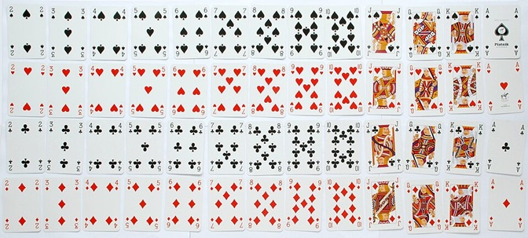

# Blank Canvas {#blank}

See Sections \@ref(RBasics), \@ref(doc).

See equation \@ref(eq:union).

See Figure \@ref(fig:car), and \@ref(fig:cards) and Table \@ref(tab:nice-tab).

```{r car, fig.cap='Car', out.width='80%', fig.asp=.75, fig.align='center'}
plot(cars)
```

```{r cards, fig.cap = "Sample Space of Drawing One Card from Standard Deck. Picture from [wikipedia](https://en.wikipedia.org/wiki/Standard_52-card_deck)", echo = FALSE}

```


